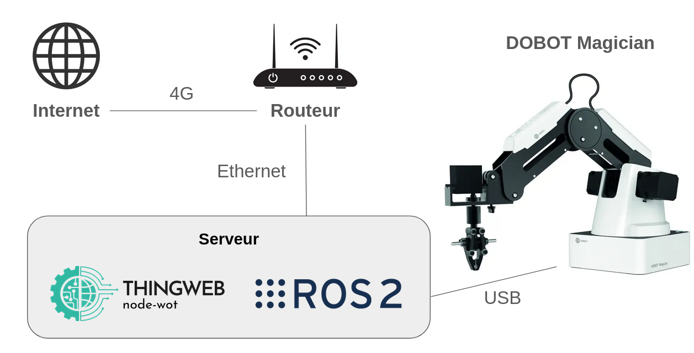

# The-server-that-handles-real-dobot
### Web of Things Server for Controlling Dobot Magician




This Web of Things (WoT) server controls the real Dobot Magician by sending action commands through ROSBridge. Follow the instructions below to set it up and use it effectively.

#### 1. Install Required Software

- **ROS 2 Humble:** Follow the official installation guide: [ROS 2 Humble Installation](https://docs.ros.org/en/humble/Installation/Ubuntu-Install-Debs.html).
- **ROSBridge:**
  ```bash
  sudo apt-get install ros-humble-rosbridge-server
  ```

#### 2. Create a Workspace for the Control System

1. Source your ROS 2 setup file:
   ```bash
   source /opt/ros/humble/setup.bash
   ```
2. Create the workspace:
   ```bash
   mkdir -p ~/magician_ros2_control_system_ws/src
   ```
3. Clone the required repository:
   ```bash
   git clone https://github.com/jkaniuka/magician_ros2.git ~/magician_ros2_control_system_ws/src
   ```
4. Build the workspace:
   ```bash
   cd ~/magician_ros2_control_system_ws
   rosdep install -i --from-path src --rosdistro humble -y
   colcon build
   ```

#### 3. Install Required Python Packages

Install the following Python packages:
```bash
pip install numpy==1.21.5 pybullet==3.2.5 PyQt5==5.15.7 pyserial==3.5 pytest==6.2.5 python_qt_binding==0.3.4 setuptools==58.2.0 transforms3d==0.4.1
```

#### 4. Install Required ROS Packages

Install packages from the apt repository:
```bash
sudo apt install ros-humble-diagnostic-aggregator ros-humble-rqt-robot-monitor python3-pykdl
```
**Note:** After installing new RQT plugins, run:
```bash
rqt --force-discover
```
This ensures the plugins are visible in the RQT GUI. For more details, refer to the [RQT plugins issue description](https://docs.ros.org/).

#### 5. Add Your Own Package 

add your own package to use the `action_sender.py` script, follow this tutorial: [Creating Your First ROS 2 Package](https://docs.ros.org/en/humble/Tutorials/Beginner-Client-Libraries/Creating-Your-First-ROS2-Package.html).

#### 6. Import WoT Server Scripts

Import the following files for the WoT server:
- `RobotTD.json`
- `WOT.js`
- `classclient.js`
- `client.js`

#### 7. Running the System

1. **Launch ROSBridge:**
   ```bash
   ros2 launch rosbridge_server rosbridge_websocket_launch.xml port:=9091
   ```
2. **Prepare Access to Serial Ports:**
   To communicate with the robot via serial ports:
   ```bash
   sudo usermod -a -G dialout <username>
   ```
   Replace `<username>` with your username. A relogin or reboot is required.

   **Note:** The USB port for Dobot Magician is set to `/dev/ttyUSB0` by default. You can change this in the configuration file.

3. **Connect the Dobot Magician:**
   - Connect the robot via USB to your computer.
   - Turn on the robot.

4. **Set the MAGICIAN_TOOL Environment Variable:**
   Specify the robot's configuration:
   ```bash
   export MAGICIAN_TOOL=<tool_type>
   ```
   Replace `<tool_type>` with one of the following values: `none`, `pen`, `suction_cup`, `gripper`, `extended_gripper`.

5. **Source the Workspace:**
   From the `magician_ros2_control_system_ws` directory, run:
   ```bash
   . install/setup.bash
   ```

6. **Launch the Control Stack:**
   ```bash
   ros2 launch dobot_bringup dobot_magician_control_system.launch.py
   ```

7. **Run the Action Sender:**
   ```bash
   ros2 run dobot_control action_sender
   ```
   The action sender listens to server commands through ROSBridge.

8. **Run the WoT Server:**
   ```bash
   node WOT.js
   ```
9. **Send Commands with the Client:**
   ```bash
   node client.js
   ```

Your WoT server is now ready to control the Dobot, change the value of x, y, z and r to see the mouvement


